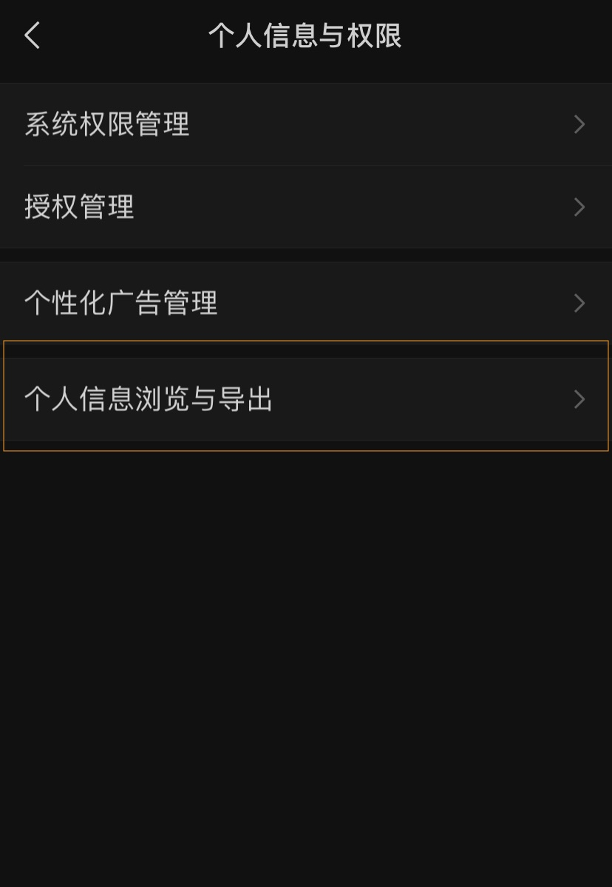
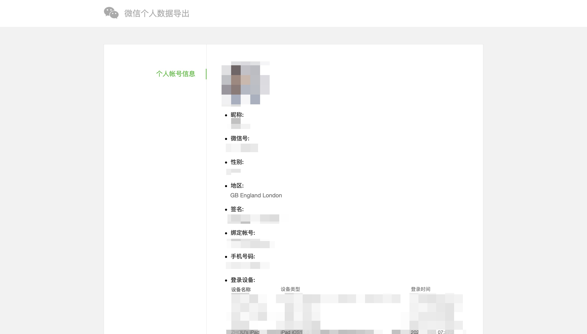

## 加入这场变革

前些时间，微信允许用户导出自己的部分个人信息到邮箱里面。

为什么微信要这么做？

我想因为这是大势所趋。

2021 年中国通过了[个人信息保护法](http://www.npc.gov.cn/npc/c30834/202108/a8c4e3672c74491a80b53a172bb753fe.shtml)，全面加强了信息隐私保护立法。全球层面，用户对于自己用户的掌控权的要求也越来越高。

确实，用户的数据应该为用户所有，他们应该有对数据的拥有权，使用权，和删除权。腾讯这么做是符合大势的。

但是我觉得还不够。目前微信个人数据导出下载下来的信息基本上没有什么用处。用户的聊天记录也是用户的数据和隐私。为什么微信不支持用户导出这些珍贵的数据，并且脱离微信查看呢？

虽然能够导出的数据不是很多，但是这是科技公司往前迈出的值得庆祝的一步。

据我了解，不少用户和我有相同的需求，即希望导出自己的微信数据（主要是聊天记录），为自己所用。比如说，我想把数据备份到云盘，可以随时随地查看。这样我可以删除微信的本地聊天记录，为手机减负。同时，我也希望自己能够分析自己的聊天行为和文本，用”大数据“来理解自己的行为模式。

而这些，目前微信都不支持。

我相信，支持聊天记录导出是符合大势的。给用户他们要的对数据的掌控。wemory 提供的就是这样的掌控。

但是要真正实现让软件提供者开放权限让用户更方便地使用自己的数据，用户和立法者需要共同努力。

我们已经实现了第一步。我相信，在未来，我们将能够很方便地下载下来所有在微博，小红书，微信等等软件里面的内容和数据。

你愿意加入到这场变革里面来吗？

### 未来

wemory 可能会被腾讯替代。

微信可能会有以下策略：

1. 让微信的聊天记录和 QQ 一样可以漫游和同步，让用户可以选择保存一年，两年，或者所有聊天记录。

如果是这样，我们能做的是：

深度搜索聊天记录

微信使用年报（月报）

自动化的功能（比如生日管理）

1. 推出一个工具，允许用户导出聊天记录，并且推出一个软件，允许用户传到云端并且随时查看。（不过这样有点多此一举。）

不可否认的是，微信退出新的功能肯定会对 wemory 带来冲击。（不过更多是如何让自己 survive，而不是去担心对手，包括腾讯）。

