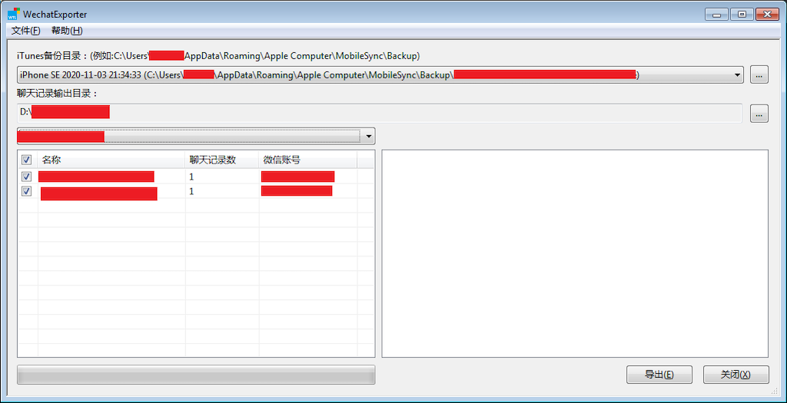
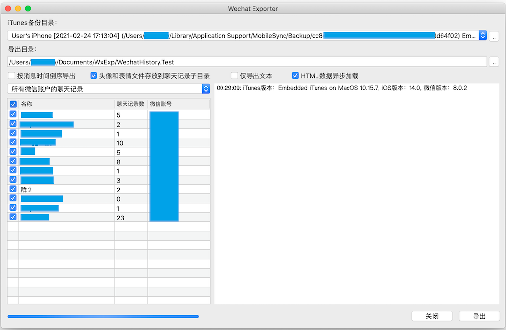
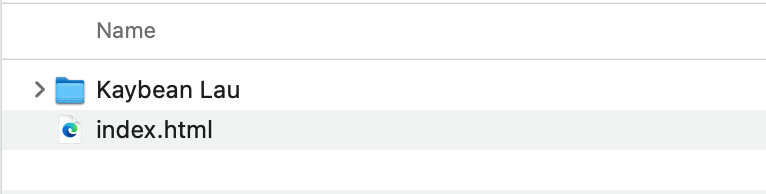
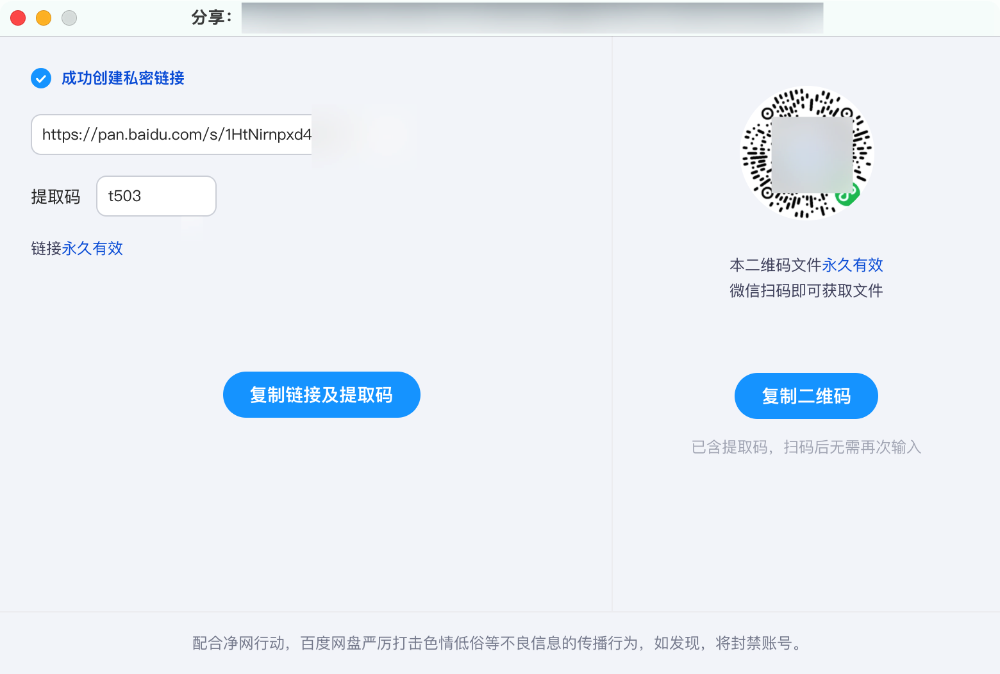

## 开始前你需要准备的东西

1. iPhone 或者 iPad

2. 有足够内存的电脑（Mac或者 Windows 系统皆可），比如你的手机已经使用了 80GB的储存，那么为了使用 wemory ，你的电脑也应该至少有 80GB 的内存

3. 3 个小时的时间

4. 使用 wemory需要的软件

   * Wechat Exporter (GitHub开源软件，5MB，credit@BlueMatthew) [Mac OS](https://github.com/BlueMatthew/WechatExporter/releases/download/v1.9.0.2/v1.9.0.2_x64_macos.zip),[Windows](https://github.com/BlueMatthew/WechatExporter/releases/download/v1.9.0.2/v1.9.0.2_x64_win.zip)

   * iTunes（Windows 用户需要下载，其中一个即可）

   - * [下载 Windows 10（64 位）版 iTunes](https://secure-appldnld.apple.com/itunes12/001-97787-20210421-F0E5A3C2-A2C9-11EB-A40B-A128318AD179/iTunes64Setup.exe)
   - * [下载 Windows 10（32位）版 iTunes](https://secure-appldnld.apple.com/itunes12/001-97791-20210421-F0E1AA9C-A2C9-11EB-8059-A028318AD179/iTunesSetup.exe)
   - * [下载 Windows 8（64位）版 iTunes](https://secure-appldnld.apple.com/itunes12/001-80053-20210422-E8A3B28C-A3B2-11EB-BE07-CE1B67FC6302/iTunes64Setup.exe)
   - * [下载 Windows 8（32位）版 iTunes](https://secure-appldnld.apple.com/itunes12/001-80042-20210422-E8A351F2-A3B2-11EB-9A8F-CF1B67FC6302/iTunesSetup.exe)

   * 压缩软件（推荐免费的 [Bandizip](https://cn.bandisoft.com/bandizip/) 或者 [7Z](https://sparanoid.com/lab/7z/)，实际上，任何大众压缩软件皆可）

 

## 都准备好了吗？我们开始吧。

 

### 第一步：创建一个手机全备份

备份你的iPhone到电脑上。 这一步我就不重复造轮子了，引用苹果官网的备份教程：

 

**使用 Mac 备份 iPhone**

1. 使用线缆连接 iPhone 和电脑。

2. 在 Mac 上的“访达”边栏中，选择您的 iPhone。

若要使用“访达”备份 iPhone，您需要使用 macOS 10.15 或更高版本。如果运行的是 macOS 的较早版本，请[使用 iTunes](https://support.apple.com/zh-cn/guide/itunes/back-up-your-ios-device-itns3280/12.9/mac/10.14) 来备份 iPhone。

3. 在“访达”窗口顶部，点按“通用”。

4. 选择“将 iPhone 上所有的数据备份到此 Mac”。

5. 请不要加密备份。

6. 点按“立即备份”。

 

**使用 Windows PC 备份 iPhone**

1. 使用线缆连接 iPhone 和电脑。

2. 在 PC 上的 iTunes App 中，单击 iTunes 窗口左上方附近的 iPhone 按钮。

3. 单击“摘要”。

4. 单击“立即备份”（“备份”下方）。

5. 请不要加密备份。

### 第二步：用 WeChat Exporter 将所有聊天记录导出

 

下载的软件解压之后，打开对应的 .exe 或者 .app 文件，可以看到如下画面（截图全部来自该 GitHub depository）：

Windows：

 

macOS：

 

Wechat Exporter （以下简称 WE）能够自动识别iPhone 备份。如果你的电脑里面有旧的备份，请确保你选择的是最新的备份。

软件界面的右下角有一个导出按钮，默认导出的是所有的微信账号的所有聊天记录，你也可以只选择一个微信账号的聊天记录来导出。

导出后，找到对应的导出路径（即导出的记录的保存文件夹），你会看到一个index.html文件，和你的微信昵称命名的文件夹。（如果你的手机里面有多个微信，那么会有多个这样的文件夹。）

 

将导出后的HTML 文件和文件夹打包成一个压缩包（ .zip格式）备用。

下一步就是将这个压缩包上传到 wemory 服务器。

 

### **第三步：上传聊天记录到 wemory，等待奇迹发生**

上传到 wemory 服务器这一步稍微有点复杂。因为我们的服务器带宽比较慢，且接收文件的功能并不完善，所以如果你直接上传几个 G 的文件过来，很可能会失败。因此，我们决定使用更好的工具来实现这个功能：百度云。

具体是这样的：

1. 你上传打包好的文件到百度云

2. 获得文件分享的链接和提取码
3. 在注册 wemory 时，填写你的链接和提取码
4. wemory 后台服务器从百度云下载你的文件

百度云获得分享链接和提取码的方式如图：

如果你不希望通过百度云上传，那么你也可以在 wemory.co 注册你的账号。进入账户之后，将打包好的压缩包拖到网页的上传处。如果你使用这个方式，那么可能会出现多次上传失败，以及上传速度慢的问题。

注册完成后（或者上传完成后），请静待大约 12 个小时，你就可以在网页上看到你的聊天记录啦！（我们的服务器速度比较慢，见谅！）

 

**附注**

你可能会经历很多困难，尤其是当你的手机里面的东西很多（上百个 G的时候）。不要气馁，多试几次！想想如果手机丢了，里面的记录都没有了，会多么遗憾啊！不要等到失去后才去珍惜！

多次尝试后，如果还是不行，欢迎你致电我们，17150307075，我们乐意为你解答问题，也可以线下约在咖啡店为你解决！

[wemory.co](wemory.co)

联系我们：

zhous.vip+wemory@gmail.com